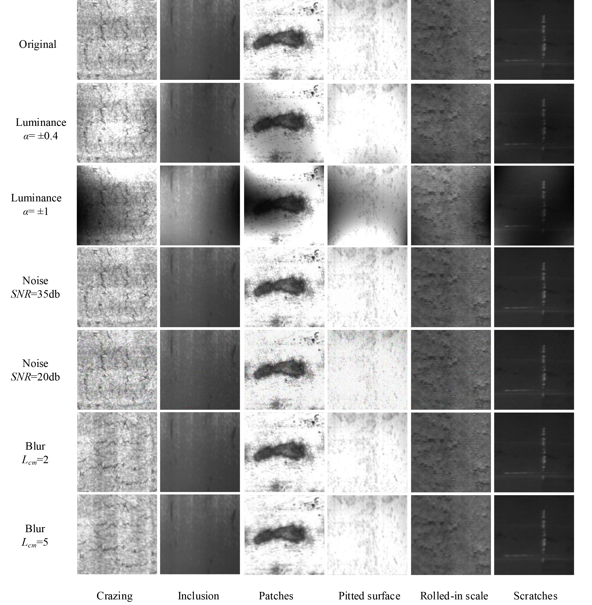

# A Deep-Learning-Based Approach For Fast And Robust Steel Surface Defects Classification

By  Guizhong Fu, Peize Sun, Wenbin Zhu, Jiangxin Yang, Yanlong Cao, Michael Ying Yang and Yanpeng Cao.

### Introduction
In this paper, we present a compact yet effective convolutional neural network (CNN) model, which emphasizes the training of low-level features and incorporates multiple receptive fields, to achieve fast and accurate steel surface defect classification.Our proposed method adopts the pre-trained SqueezeNet as the backbone architecture.We also construct a diversity-enhanced testing dataset of steel surface defects to evaluate the robustness of classification models. The dataset contains severe camera noise, non-uniform illumination, and motion blur.

### Implementations
Caffe: https://github.com/BVLC/caffe

SqueezeNet: https://github.com/DeepScale/SqueezeNet

### License
Copyright(c) Guizhong Fu and Yanpeng Cao
All rights reserved.
